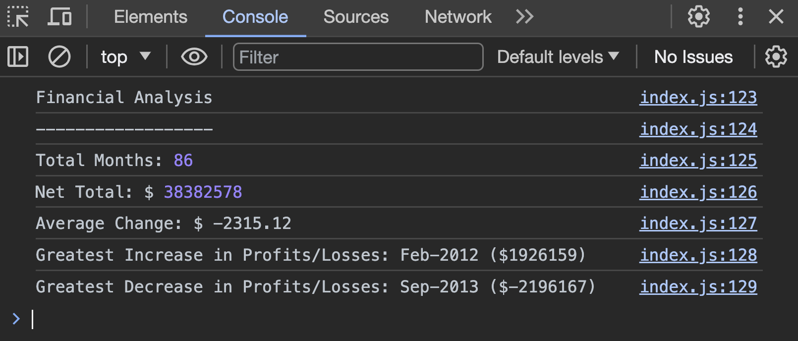

# console-finances
Console Finances - JavaScript Financial Analysis.

Tasked with creating code for analyzing the financial records of a company.

## Table of Content

* [Installation](#installation)
* [Usage](#usage)
* [Credits](#credits)
* [License](#license)
* [Badges](#badges)

## Installation

N/A

## Usage 

To use this webpage, follow these steps:

1. **Accessing the Webpage:** You can access the webpage by opening your web browser and navigating to the URL where the page is hosted.
https://feliperyder.github.io/console-finances/
Then inspect the page and view the console log.

2. Screenshot of comand line

## Credits

! [Concatenation](https://www.w3schools.com/java/java_strings_concat.asp)

! [Functions] (https://www.w3schools.com/js/js_functions.asp)

- Technologies Used: HTML & Javascript

## License

N/A

## Badges

